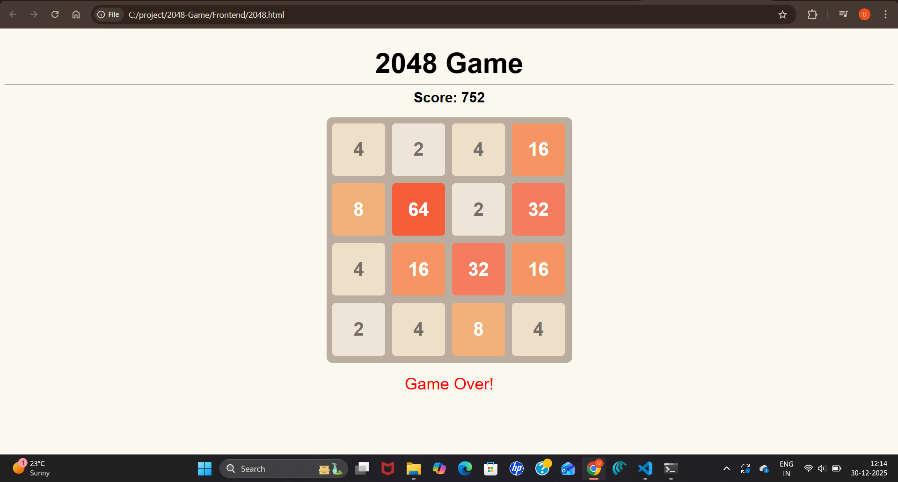

# 🎮 2048 Game (Vanilla JavaScript)

A simple and fully functional **2048 puzzle game** built using **HTML, CSS, and JavaScript**.  
Play using your keyboard arrow keys and try to reach the **2048 tile**!

---

## 🧩 Game Preview




---

## 🚀 Features

- 🎯 Classic 2048 gameplay
- ⌨️ Keyboard controls (Arrow Keys)
- 🧮 Real-time score calculation
- 🔀 Tile merging logic
- ❌ Game-over detection
- 🎨 Clean and responsive UI
- 📦 No external libraries required

---

## 🎮 How to Play

- Use **⬅️ Left Arrow** to move tiles left
- Use **➡️ Right Arrow** to move tiles right
- Use **⬆️ Up Arrow** to move tiles up
- Use **⬇️ Down Arrow** to move tiles down
- Tiles with the same number merge when they touch
- Reach **2048** to win!

---

## 🛠️ Tech Stack

- **HTML5**
- **CSS3**
- **JavaScript (ES6)**

---

## 📂 Project Structure

```
2048-game/
│
├── index.html # Main game file (HTML + CSS + JS)
└── README.md # Project documentation
```

## ▶️ Run Locally

### 1. Clone the repository:
   ```bash
   git clone https://github.com/your-username/2048-game.git

  ```
### 2.Navigate to 
```
cd 2048-game
Open index.html in your browser:
Double-click the file
OR
Use Live Server in VS Code
```

## 🌟 Future Enhancements

🔄 Restart button

📱 Mobile swipe support

🏆 Best score using localStorage

🎵 Sound effects & animations

## 🤝 Contributing

Contributions are welcome!
Feel free to fork this repo and submit a pull request.

## Author
Uma Mule <br>
<strong>Happy Coding 🧑‍💻</strong> <br>
<strong>Lot's of ❤️ from Uma</strong>